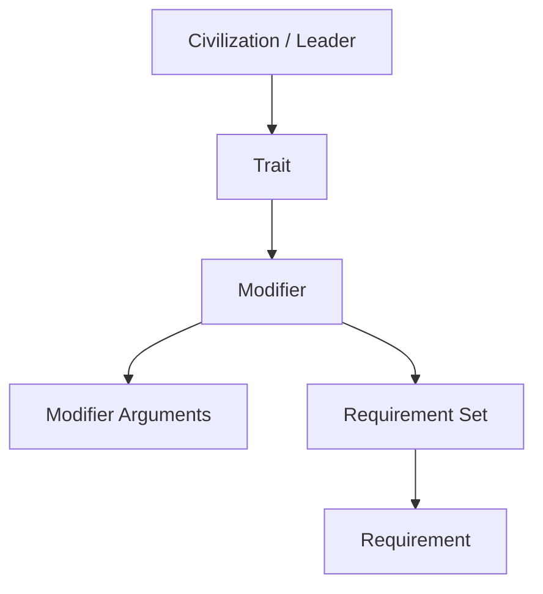

# Leader Lily — Civilization VI Custom Civilization Mod

一个以《ENDER LILIES: Quietus of the Knights》为主题的《Sid Meier's Civilization VI》自定义文明 Mod。项目使用模块化 SQL 定义 Gameplay 数据，并通过 Civilization VI 的 SQLite 数据关系实现文明、领袖、特色单位、特色区域、特色建筑、宗教能力和 DLC 兼容逻辑。

## 游戏内容

| 类型 | 内容 | 数据关系 |
| --- | --- | --- |
| 文明 | Land's End | `Civilizations`、`CivilizationTraits` |
| 领袖 | Lily | `Leaders`、`LeaderTraits`、`HistoricalAgendas` |
| 特色区域 | White Holy Site | 替代 Holy Site，包含自定义邻接与产出规则 |
| 特色单位 | Umbral Knight | 替代 Swordsman，包含单位筛选与移动效果 |
| 特色建筑 | White Priestess Statue | 替代 Temple，根据城市区域提供不同产出 |
| 宗教内容 | White Religion / Priestess's Wish | 自定义宗教、信条与 Modifier |

项目支持标准规则集，并为 Rise and Fall、Gathering Storm、Babylon Pack 和 Secret Societies 提供条件化数据库配置。界面文本包含简体中文、繁体中文、英文和日文。

## 技术实现

Gameplay 数据按领域拆分为 10 个运行时 SQL 模块，共包含 257 条经过自动校验的数据记录。各模块通过 `LeaderLily.civ6proj` 中的 `UpdateDatabase` action 按固定顺序加载；DLC 文件仅在对应 criteria 成立时执行。

SQL 数据层覆盖：

- Civilization、Leader、Agenda 与 Trait 注册及归属；
- Trait、Modifier、ModifierArguments 效果配置；
- RequirementSet、Requirement 与 RequirementArguments 条件链；
- District、Unit、Building 的替代关系、产出、前置条件和 AI 标签；
- Religion、Belief、Adjacency 与 DLC 专属扩展表。

核心对象通过稳定的类型标识建立关系：



详细表关系和查询示例见 [`docs/sql-schema.md`](docs/sql-schema.md)。

## SQL 模块

| 文件 | 职责 |
| --- | --- |
| `01_civilization.sql` | 文明注册、城市名、公民名、文明 Trait 和初始资源倾向 |
| `02_leader.sql` | 领袖、议程、AI 偏好、领袖 Trait 与加载信息 |
| `03_district.sql` | 特色区域、邻接、伟人点、贸易路线产出与条件效果 |
| `04_unit.sql` | 特色单位、替代关系、升级路径、AI 标签与移动效果 |
| `05_building.sql` | 特色建筑、前置关系、槽位、产出与城市条件效果 |
| `06_religion.sql` | 自定义宗教、信条及对应 Modifier |
| `dlc/10`–`13` | Babylon Pack、Expansion 1/2、Secret Societies 兼容配置 |

运行文件使用清晰的 `INSERT` 建立数据；开发查询使用 `SELECT`、`JOIN` 和孤立引用检查验证跨表关系。`Gameplay/SQL/dev/91_maintenance_transaction.sql` 提供带主键约束的 `UPDATE`、依赖行 `DELETE` 和事务回滚示例，不参与 Mod 运行时加载。

## 项目结构

```text
LeaderLily_SQL/
├── Gameplay/SQL/
│   ├── 01_civilization.sql
│   ├── 02_leader.sql
│   ├── 03_district.sql
│   ├── 04_unit.sql
│   ├── 05_building.sql
│   ├── 06_religion.sql
│   ├── dlc/                    # 按扩展包和游戏模式条件加载
│   └── dev/                    # 数据检查与维护查询，不参与运行时加载
├── Data/                       # Configuration、Icon、Color 与验证源数据
├── DLC/                        # DLC 数据验证源文件
├── Text/                       # 多语言本地化
├── ArtDefs/ Assets/ Textures/  # Civilization VI 美术和资源定义
├── docs/                       # 数据关系、模块映射和验证报告
├── tools/                      # SQL 生成与 SQLite 自动验证工具
└── LeaderLily.civ6proj         # ModBuddy 工程与 action 加载配置
```

## 数据验证

`tools/validate_equivalence.py` 使用 Python 标准库和两个隔离的内存 SQLite 数据库，对每个数据模块执行以下检查：

1. 解析源数据并保留字段缺省语义；
2. 执行对应 SQL 模块并检查语法；
3. 按表比较完整的排序结果集；
4. 报告模块级表数、记录数和差异。

运行验证：

```bash
python tools/validate_equivalence.py
```

当前结果：

```text
PASS  all 10 modules, 257 source rows equivalent
```

`Gameplay/SQL/dev/90_validation_queries.sql` 还提供 Civilization → Leader → Trait、Trait → Modifier → Requirement 等多表 `JOIN`，以及特色内容替代关系和孤立 Modifier 引用检查。完整结果见 [`docs/validation-report.md`](docs/validation-report.md)。

## 构建与运行

### 环境

- Sid Meier's Civilization VI
- Civilization VI Development Tools / ModBuddy
- Python 3.9 或更高版本（仅验证工具需要）

### ModBuddy

1. 克隆仓库并使用 ModBuddy 打开 `LeaderLily.civ6proj`；
2. 配置 Civilization VI SDK Assets 路径；
3. 执行 Build；
4. 启动游戏并在 Additional Content 中启用 Mod；
5. 检查 `Database.log` 与 `Modding.log`，确认所有 action 正常加载。

本仓库发布 SQL、Python、XML、ArtDef、XLP 和工程配置等源码。受第三方知识产权约束的 `.dds`、`.bnk`、`.wem` 媒体二进制不包含在源码分发中；构建完整媒体版本时，需要使用具有合法使用权的对应资源。

## 数据文件说明

`LeaderLily.civ6proj` 的 Gameplay action 直接加载 `Gameplay/SQL/`。`Data/` 和 `DLC/` 中与 Gameplay 对应的 XML 文件作为验证输入保留，不是运行时 Gameplay 数据源。Configuration、Icons、Colors、Localization 和 Art 使用各自的 Civilization VI action 与原生文件格式。

模块路径与 action 对应关系见 [`docs/migration-map.md`](docs/migration-map.md)。

## 许可证与版权

项目自有 SQL、Python 工具和文档采用 MIT License，具体范围见 [`LICENSE`](LICENSE)。Civilization VI、ENDER LILIES 及相关名称、美术、音频和游戏资产的权利归各自权利人所有；本仓库不对第三方内容授予许可。
