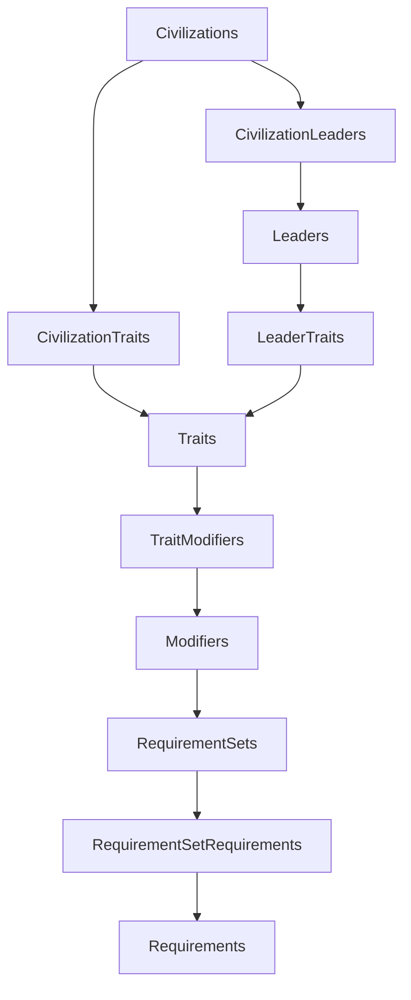
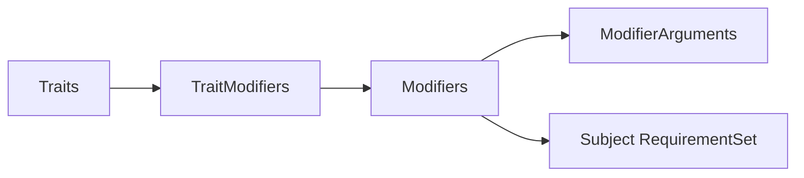
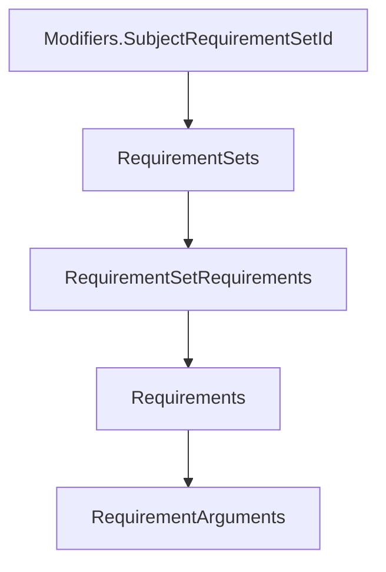

# Civilization VI Gameplay SQL 关系说明

本文解释本 Mod 实际使用的核心 SQLite 关系。Civilization VI 数据表通常依靠约定的 `Type` 字符串关联；这些字段在逻辑上相当于主键/外键，即使运行数据库未对每条关系启用 SQLite foreign key constraint，也必须保持引用一致。

## 总体关系



`ModifierArguments` 从属于 `Modifiers`，`RequirementArguments` 从属于 `Requirements`。它们都是 `(父级 ID, Name, Value)` 形式的参数表。

## 1. Type 注册

`Types(Type, Kind)` 是自定义对象进入 Gameplay 数据库的注册入口。例如：

| Type | Kind | 后续主表 |
| --- | --- | --- |
| `CIVILIZATION_LAND_S_END` | `KIND_CIVILIZATION` | `Civilizations` |
| `LEADER_LILY` | `KIND_LEADER` | `Leaders` |
| `TRAIT_LEADER_LILY` | `KIND_TRAIT` | `Traits` |
| `DISTRICT_WHITE_HOLY_SITE` | `KIND_DISTRICT` | `Districts` |
| `UNIT_UMBRAL_KNIGHT` | `KIND_UNIT` | `Units` |
| `BUILDING_WHITE_PRUESTESS_STATUE` | `KIND_BUILDING` | `Buildings` |

## 2. Civilization 与 Leader

`Civilizations` 和 `Leaders` 分别定义文明与领袖；`CivilizationLeaders` 是连接表：

```sql
SELECT c.CivilizationType, cl.LeaderType, cl.CapitalName
FROM Civilizations AS c
JOIN CivilizationLeaders AS cl
  ON cl.CivilizationType = c.CivilizationType
WHERE c.CivilizationType = 'CIVILIZATION_LAND_S_END';
```

本项目结果是 `CIVILIZATION_LAND_S_END -> LEADER_LILY`，首都为 `LOC_CITY_NAME_WHITE_PARISH`。

## 3. Trait：能力归属层

Trait 将“对象是谁”与“它具有什么能力”分开：

- `CivilizationTraits(CivilizationType, TraitType)`：文明能力、特色区域、特色建筑；
- `LeaderTraits(LeaderType, TraitType)`：领袖能力、特色单位；
- `AgendaTraits(AgendaType, TraitType)`：AI 议程行为。

本项目中的归属示例：

| Owner | Trait | 含义 |
| --- | --- | --- |
| Land's End | `TRAIT_CIVILIZATION_LAND_S_END` | 文明能力 |
| Land's End | `TRAIT_DISTRICT_WHITE_HOLY_SITE` | 特色区域 |
| Land's End | `TRAIT_BUILDING_WHITE_PRUESTESS_STATUE` | 特色建筑 |
| Lily | `TRAIT_LEADER_LILY` | 领袖能力 |
| Lily | `TRAIT_UNIT_UMBRAL_KNIGHT` | 特色单位 |

## 4. Modifier：效果层



以 Umbral Knight 忽略地形移动消耗为例：

1. `TRAIT_UNIT_UMBRAL_KNIGHT` 拥有 attach modifier；
2. attach modifier 仅选择满足 `REQSET_UNIT_UMBRAL_KNIGHT` 的单位；
3. attach modifier 的参数指向实际效果 modifier；
4. 实际效果 modifier 通过参数 `Ignore=true, Type=ALL` 调整移动规则。

“Attach Modifier”模式允许先选择作用对象，再把另一个效果附着到对象上，是 Civilization VI 能力系统中的常见两层结构。

## 5. Requirement：条件层



- `RequirementSets`：定义组合方式，如 `REQUIREMENTSET_TEST_ALL`；
- `RequirementSetRequirements`：一个条件集包含哪些原子条件；
- `Requirements`：原子条件类型，如城市拥有某区域、单位类型匹配；
- `RequirementArguments`：条件参数，如 `DistrictType=DISTRICT_CAMPUS`。

白巫女雕像的城市产出效果使用多个条件集。每个条件集同时要求：

1. 城市拥有 `BUILDING_WHITE_PRUESTESS_STATUE`；
2. 城市拥有目标区域（Campus、Theater、Industrial Zone、Commercial Hub 或 Harbor）。

这样同一个建筑 Trait 可以按区域类型分别授予 Science、Culture、Production 或 Gold。

## 6. District、Unit、Building 替代关系

特色内容并不是通过覆盖基础表实现，而是由 replacement bridge 显式关联：

| 表 | 自定义对象 | 被替代对象 |
| --- | --- | --- |
| `DistrictReplaces` | `DISTRICT_WHITE_HOLY_SITE` | `DISTRICT_HOLY_SITE` |
| `UnitReplaces` | `UNIT_UMBRAL_KNIGHT` | `UNIT_SWORDSMAN` |
| `BuildingReplaces` | `BUILDING_WHITE_PRUESTESS_STATUE` | `BUILDING_TEMPLE` |

对象本身的成本、前置条件、产出和 AI 标签分别存放在 `Districts`、`Units`、`Buildings` 及其子表中。

## 7. Adjacency 与 DLC 条件加载

`District_Adjacencies` 和 `Improvement_Adjacencies` 通过 `YieldChangeId` 引用 adjacency rule。部分规则由游戏本体/DLC 已定义，部分由本 Mod 在 `Adjacency_YieldChanges` 新增。

DLC SQL 没有合并进核心文件，因为它们依赖不同 schema 内容：

- Babylon Pack：Mahavihara 与 White Holy Site 邻接；
- Expansion 1：Government Plaza faith adjacency 与时代瞬间图片；
- Expansion 2：额外邻接、`Units_XP2.ResourceCost` 与时代瞬间图片；
- Secret Societies：Ley Line faith adjacency。

`LeaderLily.civ6proj` 延续原 criteria，仅在相应 DLC / 游戏模式存在时执行对应 SQL。

## 8. 完整性检查

`Gameplay/SQL/dev/90_validation_queries.sql` 包含以下检查：

- Civilization → Leader → Trait 多表关联；
- Trait → Modifier → RequirementSet → Requirement → Arguments 关系展开；
- District / Unit / Building replacement 完整性；
- `TraitModifiers` 指向不存在 Modifier 的孤立引用。

XML→SQL 的逐模块数据等价由 `tools/validate_equivalence.py` 自动检查。
